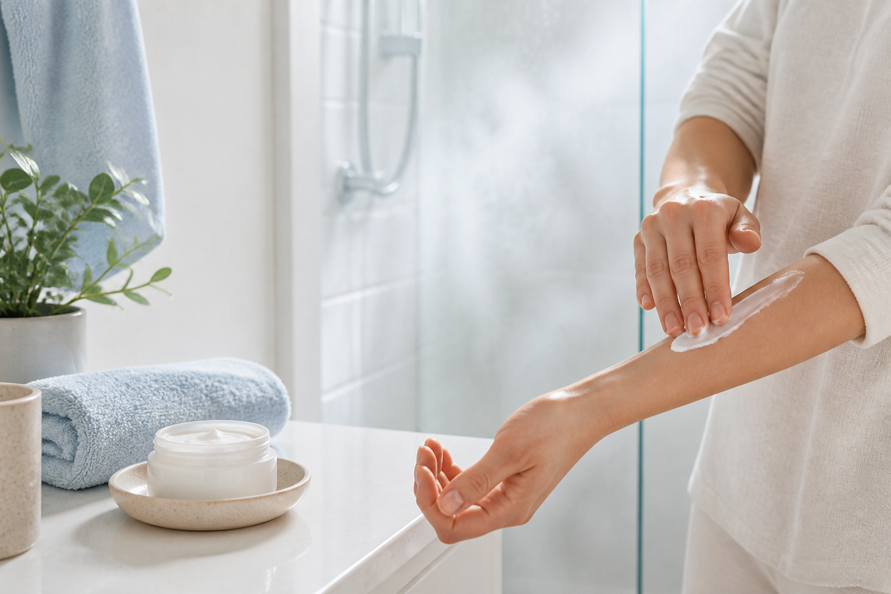

이 그림에서 볼 부분은 샤워 자체보다 물기가 남아 있을 때 보습제를 바르는 순서다.

처음엔 성인 아토피(아토피피부염, 가려움과 피부 염증이 반복되는 질환)를 단순히 건조한 피부로 생각했다. 그런데 더운 물로 오래 씻은 날, 수건으로 세게 문지른 날에는 팔 안쪽 가려움이 밤까지 이어졌다. 그래서 2주 동안 샤워 시간, 물 온도, 보습 시점, 가려움 점수(0~10점)를 적었다. 내 기록에서 가장 차이가 컸던 건 비싼 제품이 아니라 샤워 뒤 3분 안에 보습하는 습관이었다.

## 매일 기록한 루틴

| 항목 | 내가 지킨 기준 | 기록할 내용 |
|---|---|---|
| 샤워 | 미지근한 물, 5~10분 | 뜨거운 물·긴 샤워 여부 |
| 세정 | 향료 없는 순한 세정제, 필요한 부위만 | 따가움과 당김 |
| 보습 | 물기를 톡톡 닦고 피부가 촉촉할 때 크림·연고형 보습제 | 바른 시각, 가려움 0~10 |
| 환경 | 땀, 건조한 실내, 새 세제 사용 여부 | 그날의 악화 요인 |

보습제는 로션보다 유분이 많은 크림이나 연고형이 건조한 날 버티기 편했다. 다만 제품 이름보다 무향(fragrance-free)인지가 먼저였다. 새 제품은 팔 안쪽 작은 부위에 7~10일 시험한 뒤 넓게 쓰는 방식으로 자극 여부를 봤다. ‘무향(unscented)’이라고 적혀 있어도 향을 가린 제품일 수 있어 성분표를 확인했다.

## 최신 근거와 내 기록이 만난 지점

2026년 5월 *Journal of the American Academy of Dermatology*에 실린 기본 피부관리 리뷰는 보습제와 적절한 목욕을 아토피피부염의 중증도와 관계없이 기본 관리로 설명한다. 다만 최적의 샤워 횟수·시간·물 온도를 하나의 숫자로 정할 근거는 아직 제한적이다. 미국피부과학회(AAD) 성인 지침도 보습제는 강하게 권고하지만 목욕과 wet-wrap(젖은 붕대로 피부를 감싸 수분을 유지하는 방법)은 조건부 권고로 구분한다.

그래서 ‘무조건 매일 오래 씻기’나 ‘표백제 목욕’을 따라 하지 않았다. 특히 표백제 목욕과 wet-wrap은 피부 감염이나 증상 정도에 따라 의료진 지시가 필요한 방법이다. 내 경우에는 샤워를 줄이는 것보다 뜨거운 물과 마찰을 없애는 쪽이 실천하기 쉬웠다.

## 진료를 미루지 않을 신호

진물이 나거나 노란 딱지가 생기고, 통증·열감·빠르게 번지는 붉은 부위가 나타나면 피부 감염 가능성을 확인해야 한다. 보습을 해도 잠을 깨는 가려움이 계속되거나 얼굴·눈꺼풀·손처럼 생활에 직접 영향을 주는 부위가 악화될 때도 기록만 붙들고 버티지 않는 편이 낫다.

아토피피부염의 진단과 치료는 의사와 상담해야 한다. 이 글은 의학적 진단·치료 조언이 아니라, 증상과 생활 조건을 함께 기록해 진료 때 설명하기 쉽게 만든 관리 경험 정보다.

### 짧게 정리

- 샤워는 짧고 미지근하게, 피부를 문지르지 않는다.
- 물기가 남아 있을 때 무향 보습제를 바르고 시각을 적는다.
- 샤워 횟수나 표백제 목욕을 모든 사람에게 똑같이 적용하지 않는다.
- 진물·노란 딱지·통증·빠른 확산은 진료 기준으로 본다.

출처: [American Academy of Dermatology 성인 아토피피부염 2025 집중 업데이트](https://www.aad.org/member/clinical-quality/guidelines/atopic-dermatitis/), [Baek et al., *Journal of the American Academy of Dermatology*, 2026](https://pubmed.ncbi.nlm.nih.gov/42209110/), [NIAMS 아토피피부염 생활관리 안내](https://www.niams.nih.gov/health-topics/atopic-dermatitis/diagnosis-treatment-and-steps-to-take)
